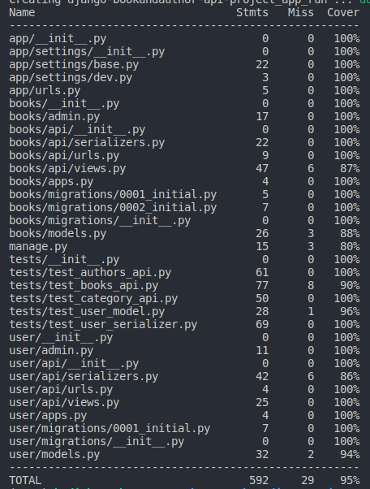

# Books and Authors API

### This porject made to get a better understanding authorization, permission and django test case


## The project iclude these technologies:

- Django Rest Framework
- Docker
- Swagger
- Django Test Case


## How to download the project:

First, create a folder and run
```
git clone https://github.com/bedirhansahin/Django-BookAndAuthor-API-Project.git
cd Django-BookAndAuthor-API-Project
```

After, run the following commands from CMD:
```
sh setup.sh
sh run.sh
```

and you can go to [http://127.0.0.1:8090/api/docs/](http://127.0.0.1:8090/api/docs) on your own browser. You will also see endpoints there.

:warning: **Don't forget install Docker on your computer**:


## You can:

- Create a superuser 
```(docker-compose run --rm app sh -c "python manage.py createsuperuser")```
- Create a new user ----> /api/user/create/
- Create a token for authorization ----> /api/user/token/
- Create a new Book, Author and Category
- List, Update or Delete this objects


## Test report



